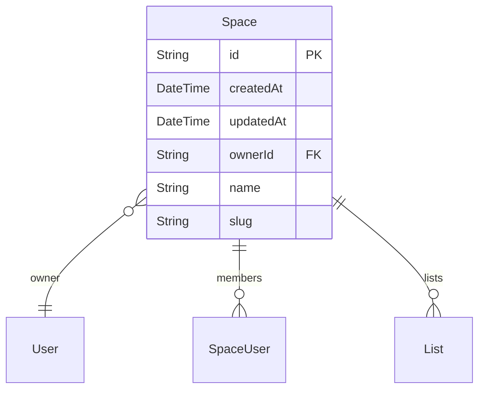
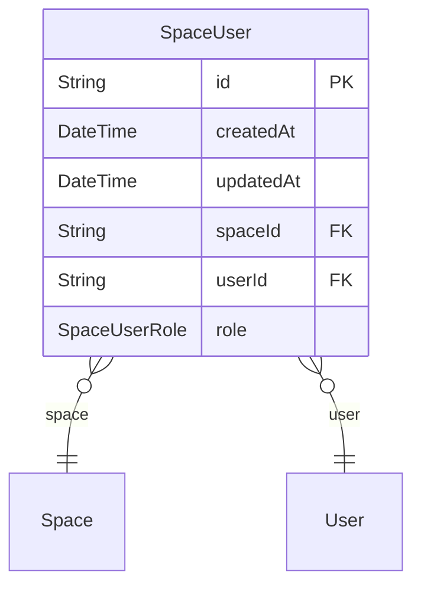
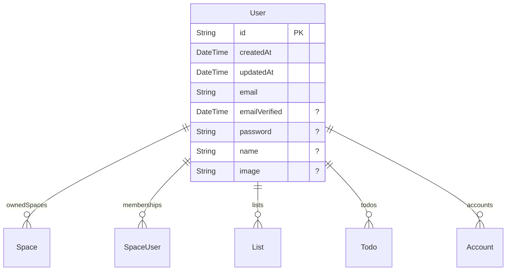
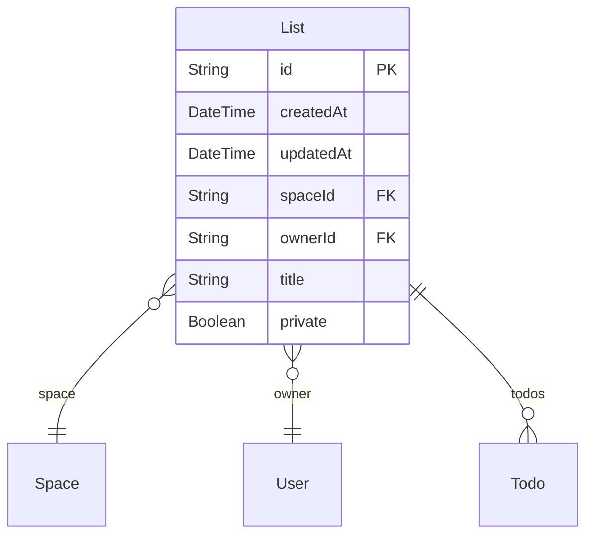
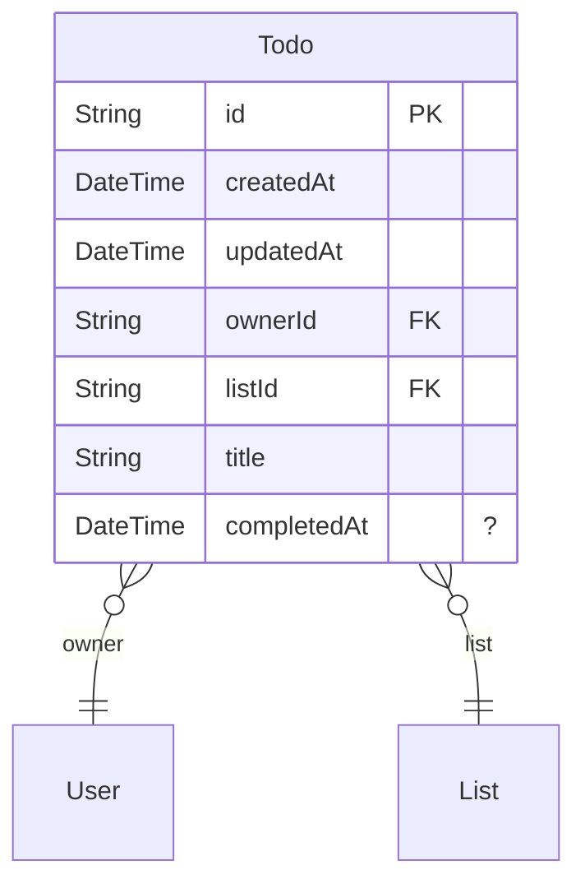
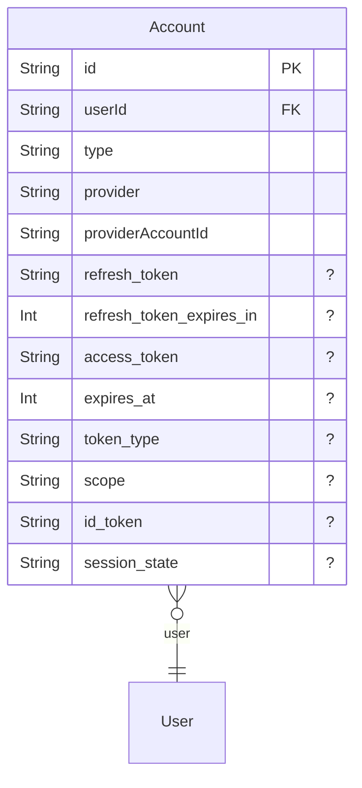

# Technical Design Document

## Overview

This ZModel schema defines the data structures and access rules for a collaborative Todo application. Users can create and manage spaces, within which they can create and share todo lists.

## Functionality

- User authentication and profile management
- Creation and management of collaborative spaces
- Membership management within spaces with different roles (USER, ADMIN)
- Creation and management of todo lists within spaces
- Creation and management of individual todos within lists
- Access control based on user roles and membership

## Enums

### SpaceUserRole

- USER
- ADMIN

## Models

- [Space](#space)
- [SpaceUser](#spaceuser)
- [User](#user)
- [List](#list)
- [Todo](#todo)
- [Account](#account)

### Space
Represents a collaborative environment where users can work together on todo lists and todos. Each space has an owner and can have multiple members with defined roles.

- Deny all operations if the user is not logged in.
- Allow any logged-in user to create a new space.
- Allow any user who is a member of the space to read the space's details.
- Allow space administrators (users who are members and have the ADMIN role) to update or delete the space.
### SpaceUser
Represents a user's membership in a specific space, including their assigned role (USER or ADMIN). Ensures unique membership per user per space.

- Deny all operations if the user is not logged in.
- Allow the space owner to add any user as a member to their space.
- Allow a space administrator (a user who is a member and has the ADMIN role) to add other users as members to the space, but not themselves.
- Allow space administrators (users who are members and have the ADMIN role) to update or delete a space user's membership (e.g., change role, remove member).
- Allow a user to read their own membership entry for spaces they are a member of.
### User
Represents a user account in the application, storing personal details, owned spaces, and memberships. It also integrates with 'next-auth' for authentication.

- Allow any user, even if not logged in, to create a new user account.
- Allow a user to read another user's information if they share at least one common space.
- Allow a user full access (create, read, update, delete) to their own user account.
### List
Represents a todo list within a space. It has an owner, a title, and can be marked as private.

- Deny all operations if the user is not logged in.
- Allow the owner of the list to read it. Also, allow any member of the space (where the list belongs) to read it if the list is not private.
- Allow creation of a list only if the current user is set as the owner and is also a member of the space where the list is being created.
- Allow the owner of the list to update it, provided the owner is also a member of the space, and the owner field is not changed during the update.
- Allow the owner of the list to delete it.
### Todo
Represents a single todo item within a todo list, with an owner, title, and completion status.

- Deny update operations if the 'owner' field is attempted to be changed.
- Allow full access (create, read, update, delete) if the parent 'List' is readable by the current user.
### Account
Part of the 'next-auth' integration, linking a user to external authentication providers.

- No explicit access control policies are defined for this model. Access is typically managed through the associated 'User' model and 'next-auth' logic.

## Security Considerations

- Unauthorized access is prevented by denying all operations to unauthenticated users on Space, SpaceUser, List, and Todo models.
- Role-based access control is implemented for Space and SpaceUser to differentiate between regular users and administrators.
- Data privacy for List models is handled by the 'private' field, restricting read access to non-owners unless the list is explicitly public and they are a space member.
- Data integrity is enforced by preventing unauthorized changes to critical fields like 'ownerId' during updates for List and Todo models.
- User information (User model) is protected, allowing read access only to users who share a common space and full access only to the user themselves.
- The 'password' field in the User model is omitted from API responses to enhance security.
- Email uniqueness and validation (e.g., using @email and @unique) ensure data consistency and prevent duplicate user accounts.
- Input validation (e.g., using @length, @regex, @url) on various fields helps prevent malicious input and ensures data quality.
- The 'onDelete: Cascade' setting in relations ensures that dependent records are automatically removed when parent records are deleted, maintaining data consistency and preventing orphaned records.